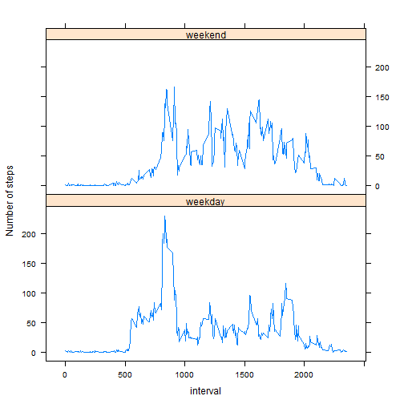

Set global options to dispaly code, supress warning messages, supress scientific notation:


```r
library(knitr)
opts_chunk$set(echo = TRUE, results = "asis")
options(scipen = 1)
```


Read activity data into a data frame:


```r
activity <- read.csv("./activity.csv", header=T, colClasses = c("numeric", "character", "numeric"))
activity$date <- as.Date(activity$date, format="%Y-%m-%d")
```


Plot histogram for daily total number of steps:


```r
dailytotal <- aggregate(steps ~ date, data=activity, sum, na.rm=TRUE)
hist(dailytotal$steps, col = "green", xlab = "Daily Total Steps", main = "Histogram of Daily Total Steps")
```

 


Calculate mean and median for daily total number of steps:


```r
stepmean <- round(mean(dailytotal$steps))
stepmedian <- median(dailytotal$steps)
```
- The mean for daily total number of steps is 10766. 
- The median for daily total number of steps is 10765. 


Time series plot of 5-minute interval and average number of steps across all days:


```r
intervalmean <- aggregate(steps ~ interval, data=activity, mean)
with(intervalmean, plot(interval, steps, type = "l", main = "Average Steps by 5-minute Interval"))
```

 


Calculate 5-minute interval with largest average number of steps:


```r
maxavgrow <- intervalmean[intervalmean$steps == max(intervalmean$steps),]
maxavginterval <- maxavgrow$interval
```
- The 5-minute interval with largest average number of steps is 835.


Calculate number of missing values (coded as "NA") in dataset:


```r
nacount <- nrow(activity[activity$steps == "NA",])
```
- Total number of missing values: 2304.


Replace missing values ("NA") with the mean of 5-minute interval:


```r
names(intervalmean) <- c("interval", "avgsteps")
activity_intervalmean <- merge(activity, intervalmean)
activity_intervalmean <- activity_intervalmean[order(activity_intervalmean$date),]
activity_intervalmean$steps <- ifelse(is.na(activity_intervalmean$steps), 
                                    activity_intervalmean$avgsteps, activity_intervalmean$steps)
activity_imputed <- activity_intervalmean[, 1:3]
```


Plot histogram for daily total number of steps with imputed NA's:


```r
dailytotal_imputed <- aggregate(steps ~ date, data=activity_imputed, sum)
hist(dailytotal_imputed$steps, col = "red", xlab = "Daily Total Steps", main = "Histogram of Daily Total Steps (imputed NA's)")
```

 


Calculate mean and median for daily total number of steps with imputed NA's:


- The mean for daily total number of steps is 10766. 
- The median for daily total number of steps is 10766. 
- The mean remain the same at 10766 with NA's remaining in the data set as compared to 10766 with NA's being imputed.
- The median increased slightly from 10765 with NA's remaining in the data set to 10766 with NA's being imputed.
- With NA's being removed from the data set, the frequency for daily total of steps in the range 10000-15000 is around 35 which is slightly higher than with NA's being in the data set which is around 30.

Panel plot for 5-minute interval average number of steps for weekdays vs. weekends:


```r
library(lattice)
activity_imputed$wdwe <- as.factor(ifelse(weekdays(activity_imputed$date) %in% c("Saturday","Sunday"), "weekend", "weekday"))
intervalmean_wdwe <- aggregate(steps ~ wdwe + interval, data=activity_imputed, FUN = mean)
xyplot(intervalmean_wdwe$steps ~ intervalmean_wdwe$interval  | intervalmean_wdwe$wdwe, type = "l", xlab = "interval", ylab = "Number of steps", layout = c(1, 2))
```

 

                            
                            


